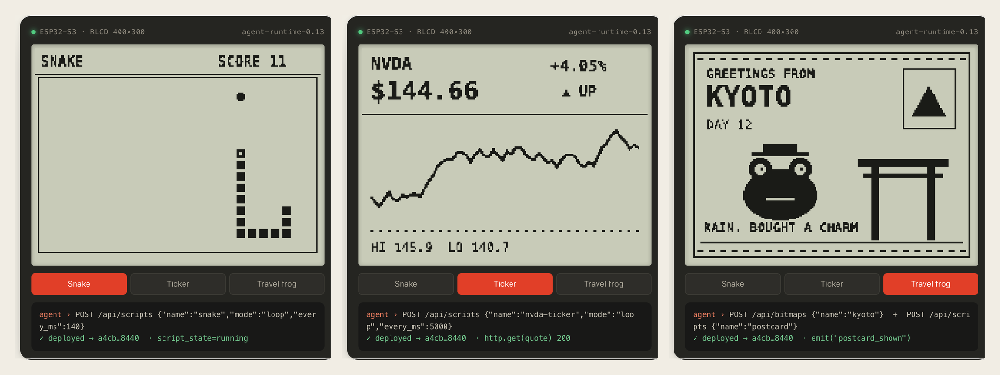
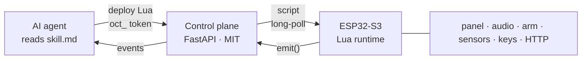

<div align="center">

# OnlyClaws ESP

**Give your agent a claw in the real world.**

Flash an ESP32 once. After that your AI agent sends Lua over HTTP,<br>
and the board draws, plays sound, moves a robot arm, reads sensors and reports back.

[](LICENSE)


[](https://onlyclaws.world/api/agent/skill.md)

[Website](https://onlyclaws.world/) · [Console](https://onlyclaws.world/console/) · [Agent API](https://onlyclaws.world/api/agent/docs) · [中文](README.zh-CN.md)



<sub>Three apps, one firmware. Each one is a Lua script the agent deployed. (Rendered from the website simulator; board photos coming.)</sub>

</div>

## Why

Agents are good at deciding *what* should happen. They have no hands. OnlyClaws turns a cheap ESP32-S3 board into a peripheral an agent can program on its own:

- **Flash once.** No more rebuilding firmware for every new screen or game. Apps are Lua scripts, swapped in seconds.
- **No model on the board.** The agent thinks in the cloud; the board runs the script and reports events.
- **Safe to hand over.** The agent holds a scoped `oct_…` token, never your password. Each board has its own `device_token`.
- **Same Lua everywhere.** Panel and audio are compile-time plugins. On a bare module, `gfx.*` and `audio.*` safely do nothing.
- **Screens and arms.** The same runtime drives a Waveshare RoArm-M2 desk arm: the agent reads joint angles and sends poses through the same token and queue.

## How it works



1. **Flash** the firmware for your board and register its device ID.
2. **Mint** an `oct_…` token in the console and give your agent [skill.md](https://onlyclaws.world/api/agent/skill.md).
3. The agent **deploys** scripts, the board runs them, and `emit()` events flow back.

## An app is a Lua script

```lua
function on_start()
  gfx.clear(0)
  gfx.text(12, 30, "hello from my agent", 1)
  gfx.fill_circle(gfx.W // 2, 150, 40, 1)
  gfx.flush()
  audio.beep(1000, 80)
end

function on_loop()
  local s = sensors()
  if input.key() then
    emit("pressed", { temp = s.temp_c })
  end
  return 200  -- ms until the next tick
end
```

The agent deploys it with one request and reads what the board reported:

```bash
curl -X POST https://onlyclaws.world/api/scripts \
  -H "Authorization: Bearer oct_…" -H "Content-Type: application/json" \
  -d '{"name":"hello","language":"lua","mode":"loop","device_id":"YOUR_DEVICE_ID","source":"…"}'

curl https://onlyclaws.world/api/events -H "Authorization: Bearer oct_…"
```

| Module | What it gives a script |
|--------|------------------------|
| `gfx` | 1-bit drawing, text, `gfx.qr`, full-frame `gfx.blit`, named bitmaps via `gfx.image`, `gfx.slow()` for e-paper pacing |
| `audio` | `beep` and PCM playback through the ES8311 |
| `sensors()` | Temperature, humidity, battery |
| `input` | On-board KEY and BOOT buttons |
| `http` | `http.get` / `http.post` to any HTTP(S) endpoint (no device credentials attached) |
| `emit(name, table)` | Report an event to the control plane for the agent |
| `ble`, `net` | BLE controller direction, Wi-Fi status |
| `arm` | RoArm builds only: `arm.feedback()` joint angles, `arm.move` / `arm.stream` poses in radians, `arm.stop()` |

An arm board runs the same kind of script. This one reads the pose, reports it, then folds the arm upright:

```lua
function on_start()
  local p = arm.feedback()          -- {base, shoulder, elbow, hand, q={...}} in radians
  emit("pose", { q = p.q })
  arm.move({ base = 0, shoulder = 0, elbow = 3.05, hand = 3.14, spd = 200 })
end
```

For low-latency control the agent can skip Lua and send one-shot `arm.move` / `arm.feedback` / `arm.stop` tools through `POST /api/invoke`. The board reports `capabilities[]` (for example `["core","arm"]`), and the control plane rejects tools a board does not have.

Full contract: [skill.md](https://onlyclaws.world/api/agent/skill.md). More apps: [`demos/`](demos/).

## Get started

Pick the path that fits.

### 1. Use the hosted console

[Apply for access](https://onlyclaws.world/apply/). Applications are reviewed by hand. Once approved you get an email with a link to set your password, then you can register boards and mint agent tokens at [onlyclaws.world/console](https://onlyclaws.world/console/).

### 2. Flash the firmware

Requires Python 3 and PlatformIO 6.

```bash
python3 -m pip install -U platformio --user
cd rlcd
cp include/device_secrets.h.example include/device_secrets.h
# Set EPD_DEVICE_ID and EPD_DEVICE_TOKEN, or leave the token empty and provision it over NVS.

pio run -e esp32-s3-rlcd-42 -t upload --upload-port /dev/cu.usbmodem*
pio device monitor -b 115200
```

To reflash without wiping the Wi-Fi credentials and token already on the board, use `bash scripts/safe_upload_keep_nvs.sh /dev/cu.usbmodem101`. Build notes and a China mirror helper are in [`rlcd/DEV.md`](rlcd/DEV.md).

### 3. Self-host the control plane

The control plane in [`server/`](server/) is a single FastAPI app with SQLite.

```bash
cd server
python3 -m venv .venv && . .venv/bin/activate
pip install -r requirements.txt
cp config.example.env .env   # set EPD_SESSION_SECRET, EPD_PUBLIC_BASE, EPD_AUTH_UPSTREAM ...
set -a && . ./.env && set +a
uvicorn app:app --host 127.0.0.1 --port 8787
```

Sign-in is delegated to an auth service set by `EPD_AUTH_UPSTREAM`: it must accept `POST /api/auth/login` and `POST /api/auth/register` with `{"email","password"}` and answer `{"success": true, ...}`. A systemd unit and nginx snippet are in [`server/deploy/`](server/deploy/). Point the firmware at your host in [`rlcd/include/cloud_config.h`](rlcd/include/cloud_config.h).

## Hardware

One source tree, four PlatformIO environments. Rewire any of them by editing [`rlcd/include/board_pins.h`](rlcd/include/board_pins.h); the Lua and cloud APIs stay the same.

| Environment | Board | What's compiled in |
|-------------|-------|--------------------|
| `esp32-s3-bare` | Any ESP32-S3 module with 16 MB flash and octal PSRAM | Core only: cloud channel, Lua, HTTP, events. Status goes to serial |
| `esp32-s3-rlcd-42` | Waveshare ESP32-S3-RLCD-4.2 | ST7305 400×300 reflective LCD (~140 ms/frame), ES8311 audio, sensors, BLE `OC-Snake` |
| `esp32-s3-epaper-397` | Waveshare ESP32-S3-ePaper-3.97 | 800×480 e-paper with partial refresh, ES8311 audio. BLE off to leave heap for TLS |
| `esp32-roarm-m2` | Waveshare RoArm-M2 driver board (classic ESP32) | Feetech STS servo bus on GPIO18/19, `arm.*` in Lua and invoke. Headless: no panel, audio or BLE, and the factory open Wi-Fi joint API is not compiled in |

On e-paper, `gfx.slow()` returns true so animations can stretch frames to about 900 ms. The same script runs on both panels. Arm product notes: [`doc/structurizr/ROARM-PRODUCT.md`](doc/structurizr/ROARM-PRODUCT.md).

## Repository

| Path | What's there |
|------|--------------|
| [`rlcd/`](rlcd/) | Firmware. Build and flash from here |
| [`server/`](server/) | Control plane: devices, scripts, events, bitmaps, console |
| [`demos/`](demos/) | Lua apps to deploy: Snake (key, phone D-pad or HTTP controller), a live RL-training dashboard, a Wi-Fi quality monitor, and RoArm pose hold |
| [`jev_servo/`](jev_servo/) | Host-side arm control: forward kinematics, USB and cloud arm channels, MCP server, web console |
| [`vision/`](vision/) | Host-side camera pipeline (YuNet, SFace, YOLOv8n) the agent can bridge into arm moves. Models: `bash vision/scripts/fetch_models.sh` |
| [`doc/structurizr/`](doc/structurizr/) | Architecture model and product notes (`python scripts/adl_check.py`) |
| [`scripts/`](scripts/) | Host setup helpers |

<details>
<summary>Legacy tree</summary>

`src/`, `include/` and the root `platformio.ini` are the earlier e-paper-only firmware. They are kept for reference; new work goes in `rlcd/`.

</details>

## Status

Firmware line `agent-runtime-0.16.x`: panel and audio plugins since `0.13.6`, RoArm-M2 arm plugin since `0.16.0`. The hosted console is invite-only while we keep costs and abuse in check. Issues and pull requests are welcome, especially new panel plugins and demo apps.

## License

Source in this repository is [MIT](LICENSE).

The `esp32-s3-epaper-397` environment links [GxEPD2](https://github.com/ZinggJM/GxEPD2) (GPL-3.0-or-later), so firmware built with that environment is distributed under GPL-3.0-or-later. The bare and RLCD environments do not link it. See [NOTICE](NOTICE).
